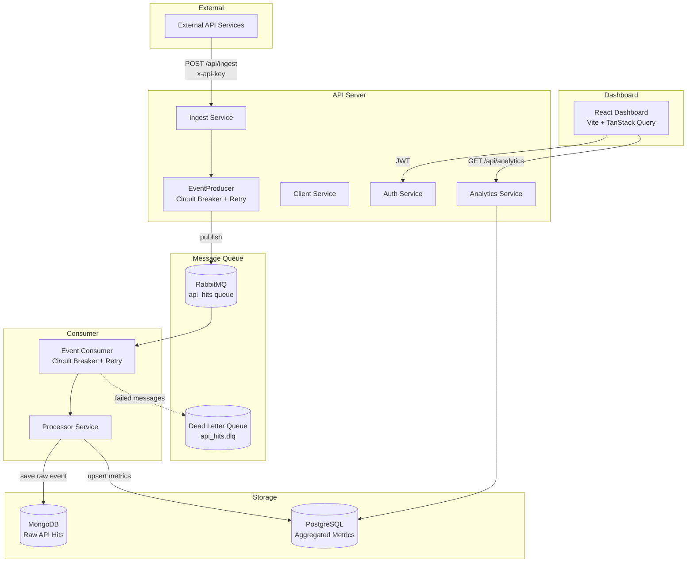
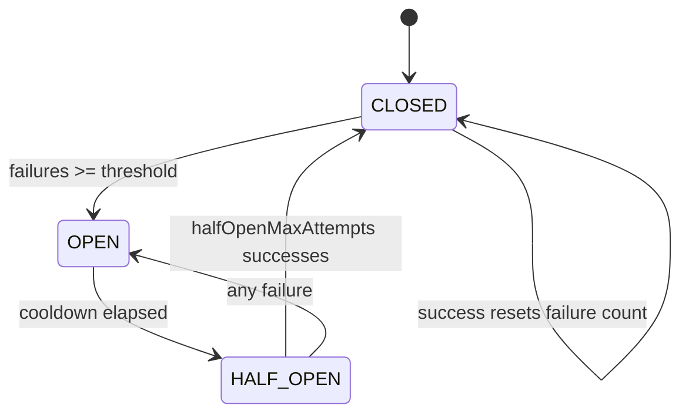

# API Monitoring System

A real-time API hit tracking and monitoring platform. External services report every API call they make; the system ingests those events asynchronously, stores raw data for audit, aggregates metrics into time buckets for fast analytics, and exposes a dashboard for visualization.

---

## Table of Contents

- [High-Level Architecture](#high-level-architecture)
- [Data Flow](#data-flow)
- [Dual Storage Strategy](#dual-storage-strategy)
- [Time Buckets](#time-buckets)
- [Circuit Breaker](#circuit-breaker)
- [Retry Strategy & Dead Letter Queue](#retry-strategy--dead-letter-queue)
- [Event Producer & Consumer](#event-producer--consumer)
- [Authentication & Authorization](#authentication--authorization)
- [Services Overview](#services-overview)
- [Project Structure](#project-structure)
- [Getting Started](#getting-started)
- [API Endpoints](#api-endpoints)
- [Configuration](#configuration)

---

## High-Level Architecture

The system follows an **event-driven, microservice-style** layout with two independently deployable Node.js processes and a React dashboard.



| Component | Role | Technology |
|-----------|------|------------|
| **API Server** | HTTP API for ingest, auth, client management, analytics | Express.js |
| **Event Consumer** | Background worker that processes queued events | Node.js (separate process) |
| **RabbitMQ** | Async message broker between ingest and processing | RabbitMQ 3 |
| **MongoDB** | Raw event store — every individual API hit | MongoDB 6 |
| **PostgreSQL** | Pre-aggregated metrics for fast dashboard queries | PostgreSQL 15 |
| **Dashboard** | Real-time metrics visualization | React 18 + Vite |

---

## Data Flow

### 1. Ingestion (write path)

1. An external service sends a `POST /api/ingest` request with an `x-api-key` header.
2. The **API key middleware** validates the key, checks client status, and verifies ingest permissions.
3. **IngestService** validates the payload (service name, endpoint, method, status code, latency) and builds an event object with a UUID `eventId`.
4. **EventProducer** attempts to publish the event to the `api_hits` RabbitMQ queue.
5. On success, the API responds with `202 Accepted` and `{ status: "queued" }`.
6. If the circuit breaker is open, the API responds with `503 Service Unavailable`.

### 2. Processing (async path)

1. The **Event Consumer** pulls messages from the `api_hits` queue (prefetch: 10).
2. Messages are validated against a Zod schema and checked for idempotency (duplicate `messageId` detection).
3. **ProcessorService** runs a two-step pipeline:
   - **Step 1 (critical):** Save the raw event to MongoDB. Failure here throws and triggers retry/DLQ.
   - **Step 2 (non-critical):** Compute the time bucket and upsert aggregated metrics into PostgreSQL. Failure is logged but does not fail the overall operation if the raw event was already saved.
4. The message is acknowledged (`ack`) on success.

### 3. Analytics (read path)

1. Authenticated users (JWT) call `GET /api/analytics/*` endpoints.
2. **AnalyticsService** queries pre-aggregated data from PostgreSQL `endpoint_metrics`.
3. The React dashboard fetches dashboard data and auto-refreshes every 30 seconds.

---

## Dual Storage Strategy

The system uses two databases with distinct responsibilities:

| Database | Purpose | Data Shape | Retention |
|----------|---------|------------|-----------|
| **MongoDB** | Raw event log | One document per API hit | 30 days (TTL index on `timestamp`) |
| **PostgreSQL** | Aggregated metrics | One row per `(client, service, endpoint, method, time_bucket)` | Indefinite |

**Why two databases?**

- **MongoDB** handles high-volume writes of individual events and supports flexible querying of raw data. The TTL index automatically purges old records.
- **PostgreSQL** stores pre-computed rollups so dashboard queries (totals, top endpoints, time series) run against a small, indexed table instead of scanning millions of raw documents.

This is a classic **Lambda architecture** pattern: write raw data to an event store, derive aggregated views for serving reads.

---

## Time Buckets

Time bucketing is the core aggregation mechanism. Instead of storing every hit as a separate analytics row, hits are grouped into fixed time windows and metrics are incrementally updated within each bucket.

### How it works

When the processor receives an event, `ProcessorService.getTimeBucket()` rounds the event timestamp down to the start of the current interval:

```javascript
// Example: event at 10:25:43 with interval "hour"
// timeBucket = 10:00:00.000

getTimeBucket(timestamp, interval = 'hour') {
    const date = new Date(timestamp);
    switch (interval) {
        case 'hour':  date.setMinutes(0, 0, 0);  break;  // [10:00 – 10:59]
        case 'day':   date.setHours(0, 0, 0, 0);  break;  // [00:00 – 23:59]
        case 'minute': date.setSeconds(0, 0);     break;  // [10:25:00 – 10:25:59]
    }
    return date;
}
```

The system currently uses **hourly buckets** (`interval = "hour"`).

### Upsert logic

Each bucket is uniquely identified by the composite key:

```
(client_id, service_name, endpoint, method, time_bucket)
```

When a new hit arrives, PostgreSQL performs an `INSERT ... ON CONFLICT DO UPDATE`:

| Metric | Update Rule |
|--------|-------------|
| `total_hits` | Increment by 1 |
| `error_hits` | Increment by 1 if `statusCode >= 400` |
| `avg_latency` | Weighted running average across all hits in the bucket |
| `min_latency` | `LEAST(existing, new)` |
| `max_latency` | `GREATEST(existing, new)` |

**Example:** Three hits to `GET /users` between 14:00 and 14:59:

| Hit | Latency | Status | Bucket State After |
|-----|---------|--------|-------------------|
| 1 | 120ms | 200 | total=1, avg=120, min=120, max=120 |
| 2 | 80ms | 500 | total=2, avg=100, min=80, max=120, errors=1 |
| 3 | 200ms | 200 | total=3, avg=133, min=80, max=200, errors=1 |

All three hits share the same row: `time_bucket = 14:00:00`.

### Querying time buckets

Analytics queries filter and group by `time_bucket`:

- **Time series** — returns metrics per bucket for charting (default: last 24 hours).
- **Top endpoints** — sums `total_hits` across all buckets in a time range, grouped by endpoint.
- **Overall stats** — aggregates across all buckets for summary cards (total hits, error rate, avg latency).

Indexes on `(client_id)`, `(time_bucket)`, and `(client_id, service_name, endpoint)` keep these queries fast even with large datasets.

---

## Circuit Breaker

The circuit breaker is a resilience pattern that prevents the system from repeatedly calling a failing dependency (RabbitMQ or the database layer). It is implemented in `CircuitBreaker.js` and used in **both** the EventProducer (publish side) and the EventConsumer (consume side).

### States



| State | Behavior |
|-------|----------|
| **CLOSED** | Normal operation. All requests are allowed. Failures are counted. |
| **OPEN** | Circuit is tripped. All requests are rejected immediately (fail-fast). No load is sent to the failing dependency. |
| **HALF_OPEN** | Cooldown has elapsed. A limited number of probe requests are allowed to test if the dependency has recovered. |

### Configuration

| Location | `failureThreshold` | `cooldownMs` | `halfOpenMaxAttempts` |
|----------|-------------------|--------------|----------------------|
| EventProducer | 2 | 30,000ms | 3 |
| EventConsumer | 5 | 30,000ms | 3 |

### Producer behavior

Before publishing to RabbitMQ, the producer calls `circuitBreaker.allowRequest()`:

- **Allowed** → publish with retry; on success call `onSuccess()`, on exhausted retries call `onFailure()`.
- **Rejected** → return `false` immediately; IngestService responds with `503 Service Unavailable` to the caller.

### Consumer behavior

Before processing a message, the consumer calls `circuitBreaker.allowRequest()`:

- **Allowed** → process the message; `ack` on success, `onFailure()` on error.
- **Rejected** → `nack` the message with requeue (`nack(msg, false, true)`) so it is retried when the circuit recovers.

### State transitions in detail

1. **CLOSED → OPEN:** Consecutive failures reach `failureThreshold`. The circuit opens and records `_lastFailureTime`.
2. **OPEN → HALF_OPEN:** After `cooldownMs` (30 seconds) elapses, the next `allowRequest()` call auto-transitions to HALF_OPEN.
3. **HALF_OPEN → CLOSED:** `halfOpenMaxAttempts` (3) consecutive successes trigger a full reset.
4. **HALF_OPEN → OPEN:** A single failure during probing immediately reopens the circuit.
5. **CLOSED (recovery):** A success while in CLOSED state resets the failure counter to zero.

---

## Retry Strategy & Dead Letter Queue

### Exponential backoff with jitter

Both the producer and consumer use `RetryStrategy` for transient failures:

```
delay = min(baseDelay × 2^attempt, maxDelay) ± jitter
```

| Parameter | Producer Default | Consumer Default |
|-----------|-----------------|-----------------|
| `maxRetries` | 3 | 3 |
| `baseDelayMs` | 1,000 | 1,000 |
| `maxDelayMs` | 5,000 | 30,000 |
| `jitterFactor` | 0.3 | 0.3 |

Retryable errors include connection resets, channel closures, timeouts, and buffer-full conditions (see `RETRYABLE_PATTERNS` in `RetryStrategy.js`).

### Dead Letter Queue (DLQ)

RabbitMQ is configured with a DLQ at `api_hits.dlq`. Messages are routed there when:

- Processing fails with a **non-retryable** error (e.g., schema validation failure).
- **Max retries are exceeded** for a retryable error.
- A **retry scheduling failure** occurs.

DLQ messages carry metadata headers: `x-dlq-reason`, `x-dlq-error`, `x-dlq-timestamp`, and `x-original-queue`.

### Poison message detection

The consumer tracks consecutive failures per event type. After 10 consecutive failures for the same type, a poison message pattern is logged — useful for alerting on systematically bad messages.

### Idempotency

The consumer maintains an in-memory set of up to 100,000 processed `messageId` values. Duplicate messages are acknowledged and skipped without reprocessing.

---

## Event Producer & Consumer

### EventProducer

Responsible for reliable message publishing to RabbitMQ.

**Key components:**

| Component | Purpose |
|-----------|---------|
| `ConfirmChannelManager` | Manages a RabbitMQ confirm channel with automatic recreation on close/error. Handles back-pressure via `drain` events. |
| `CircuitBreaker` | Fail-fast when RabbitMQ is unhealthy. |
| `RetryStrategy` | Exponential backoff for transient publish failures. |

**Message format:**

```json
{
  "type": "API_HIT",
  "data": {
    "eventId": "uuid",
    "timestamp": "2026-06-14T10:25:43.000Z",
    "serviceName": "user-service",
    "endpoint": "/api/users",
    "method": "GET",
    "statusCode": 200,
    "latencyMs": 145.2,
    "clientId": "objectId",
    "apiKeyId": "objectId",
    "ip": "10.0.0.1",
    "userAgent": "..."
  },
  "publishedAt": "2026-06-14T10:25:43.100Z",
  "attempt": 1
}
```

Messages are published as **persistent** with `messageId`, `correlationId`, and `timestamp` properties.

### EventConsumer

A standalone Node.js process (`src/services/processor/consumer.js`) that:

1. Connects to MongoDB, PostgreSQL, and RabbitMQ on startup (with 5 retry attempts).
2. Consumes from `api_hits` with `prefetch: 10` and manual acknowledgment.
3. Validates messages with Zod schema enforcement.
4. Delegates to `ProcessorService` for the two-step save pipeline.
5. Handles reconnection on channel close with automatic consumer re-registration.
6. Supports graceful shutdown on `SIGINT` / `SIGTERM`.

---

## Authentication & Authorization

The system has two access paths with different auth mechanisms:

### External ingest (API key)

- Header: `x-api-key`
- Validated against MongoDB `ApiKey` collection.
- Checks: key exists, client is active, `canIngest` permission.
- Rate limited per IP (`RATE_LIMIT_MAX_REQUESTS` per `RATE_LIMIT_WINDOW_MS`).

### Dashboard & analytics (JWT)

- `POST /api/auth/login` returns a JWT stored in an HTTP-only cookie.
- Protected routes use the `authenticate` middleware.
- Role-based access:
  - **Super admin** — can view analytics for any client (optional `?clientId` query param).
  - **Client user** — scoped to their own `clientId`; requires `canViewAnalytics` permission.

---

## Services Overview

### Ingest Service

| File | Responsibility |
|------|---------------|
| `ingestRoute.js` | Route definition with rate limiting and API key validation |
| `ingestController.js` | HTTP request/response handling |
| `ingestService.js` | Payload validation, event construction, producer invocation |

### Processor Service

| File | Responsibility |
|------|---------------|
| `consumer.js` | RabbitMQ consumer with retry, DLQ, circuit breaker, idempotency |
| `ProcessorService.js` | Two-step processing: MongoDB save + PostgreSQL upsert |
| `APIHitRepository.js` | MongoDB CRUD for raw hits |
| `MetricsRepository.js` | PostgreSQL upsert and analytics queries |

### Analytics Service

| File | Responsibility |
|------|---------------|
| `analyticsRoute.js` | Protected analytics endpoints |
| `analyticsController.js` | Permission checks, client scoping, time range validation |
| `analyticsService.js` | Business logic: stats, top endpoints, time series |

### Auth & Client Services

| File | Responsibility |
|------|---------------|
| `authService.js` | Login, JWT issuance, profile, permission checks |
| `clientService.js` | Client CRUD, API key management |
| `validateApiKey.js` | API key middleware for ingest |

---

## Project Structure

```
API-Monitoring-System/
├── server/                          # Backend API + Consumer
│   ├── src/
│   │   ├── server.js                # Express API entry point
│   │   ├── services/
│   │   │   ├── ingest/            # Event ingestion (HTTP → RabbitMQ)
│   │   │   ├── processor/         # Event consumption (RabbitMQ → DBs)
│   │   │   ├── analytics/         # Metrics queries (PostgreSQL → HTTP)
│   │   │   ├── auth/              # JWT authentication
│   │   │   └── client/            # Client & API key management
│   │   └── shared/
│   │       ├── config/              # MongoDB, PostgreSQL, RabbitMQ, app config
│   │       ├── events/
│   │       │   ├── eventContracts.js
│   │       │   └── producer/
│   │       │       ├── CircuitBreaker.js
│   │       │       ├── ConfirmChannelManager.js
│   │       │       ├── RetryStrategy.js
│   │       │       ├── eventProducer.js
│   │       │       └── createEventProducer.js
│   │       ├── middlewares/         # Auth, API key, error handling
│   │       ├── models/              # Mongoose schemas
│   │       └── utils/               # AppError, response formatter
│   ├── scripts/
│   │   └── init-postgres.sql        # PostgreSQL schema (endpoint_metrics)
│   ├── docker-compose.yml           # Full stack: PG, Mongo, RabbitMQ, API
│   ├── Dockerfile                   # API server image
│   └── Dockerfile.consumer          # Consumer worker image
│
└── dashboard/                       # React frontend
    └── src/
        ├── api/                     # Axios client
        ├── components/              # Charts, stats, layout
        ├── pages/                   # Overview, settings
        └── hooks/                   # Dashboard queries, chart theming
```

---

## Getting Started

### Prerequisites

- Node.js 18+
- Docker & Docker Compose (for infrastructure)

### 1. Start infrastructure

```bash
cd server
docker compose up -d postgres mongo rabbitmq
```

This starts PostgreSQL (port 5432), MongoDB (port 27017), and RabbitMQ (port 5672, management UI at 15672).

### 2. Configure environment

```bash
cd server
cp .env.example .env
# Edit .env with your local settings
```

### 3. Start the API server

```bash
cd server
npm install
npm run dev
```

API available at `http://localhost:5000`.

### 4. Start the event consumer

In a separate terminal:

```bash
cd server
node src/services/processor/consumer.js
```

### 5. Start the dashboard

```bash
cd dashboard
npm install
cp .env.example .env
npm run dev
```

Dashboard available at `http://localhost:5173`.

### Docker (full stack)

```bash
cd server
docker compose up -d
```

---

## API Endpoints

### Public

| Method | Path | Auth | Description |
|--------|------|------|-------------|
| `GET` | `/health` | None | Health check |
| `POST` | `/api/ingest` | API Key | Ingest an API hit event |
| `POST` | `/api/auth/login` | None | Login and receive JWT |

### Protected (JWT required)

| Method | Path | Description |
|--------|------|-------------|
| `GET` | `/api/analytics/stats` | Overall statistics for a time range |
| `GET` | `/api/analytics/dashboard` | Combined dashboard data (stats + top endpoints + time series) |

### Ingest payload example

```bash
curl -X POST http://localhost:5000/api/ingest \
  -H "Content-Type: application/json" \
  -H "x-api-key: your-api-key" \
  -d '{
    "serviceName": "user-service",
    "endpoint": "/api/users",
    "method": "GET",
    "statusCode": 200,
    "latencyMs": 145.2
  }'
```

Response (`202 Accepted`):

```json
{
  "success": true,
  "data": {
    "eventId": "a1b2c3d4-...",
    "status": "queued",
    "timestamp": "2026-06-14T10:25:43.000Z"
  },
  "message": "API hit queued for processing"
}
```

---

## Configuration

Key environment variables (see `server/.env.example` for the full list):

| Variable | Default | Description |
|----------|---------|-------------|
| `PORT` | `5000` | API server port |
| `MONGO_URI` | `mongodb://localhost:27017/api_monitoring` | MongoDB connection |
| `PG_HOST` | `localhost` | PostgreSQL host |
| `RABBITMQ_URL` | `amqp://localhost:5672` | RabbitMQ connection |
| `RABBITMQ_QUEUE` | `api_hits` | Primary queue name |
| `RABBITMQ_RETRY_ATTEMPTS` | `3` | Max publish/process retries |
| `RABBITMQ_RETRY_DELAY` | `1000` | Base retry delay (ms) |
| `JWT_SECRET` | — | JWT signing secret |
| `RATE_LIMIT_WINDOW_MS` | `900000` | Rate limit window (15 min) |
| `RATE_LIMIT_MAX_REQUESTS` | `1000` | Max requests per window per IP |

---

## License

MIT
